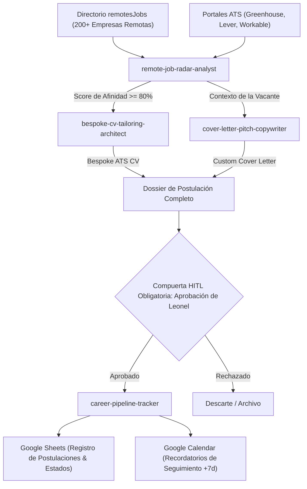

# Remote Jobs & Reactive Resume Career Ecosystem — Universal Antigravity Architecture

**Autoría Oficial:** Nomack Studio & Antigravity Enterprise Architecture ([`Nomackleo/remotesJobs`](https://github.com/Nomackleo/remotesJobs))  
**WHAT:** Ecosistema Agéntico de Inteligencia de Empleo Remoto, Generación Reactiva de Currículums Hiperpersonalizados (Bespoke CVs), Redacción de Cartas de Presentación y Gestión de Pipeline de Postulaciones con Validación *Human-in-the-Loop* (HITL) Obligatoria, optimizado para sistemas ATS y basado en el perfil verificado de Leonel Salcedo.  
**División Corporativa:** `05_commercial_and_growth` (Commercial, Growth & Executive Brand / Career Operations).  
**Cumplimiento Normativo:** ISO 9001:2015, ISO 27001 (Privacidad de Datos y Confidencialidad), ISO/IEC 42001 (AIMS).

---

## 1. Topología del Ecosistema Agéntico (Graphify Map)

---

## 2. Catálogo de Subagentes Especialistas (Neo-CRISPE v2.0)

| Subagente | Responsabilidad Principal | Herramientas & Ámbitos |
| :--- | :--- | :--- |
| **[`remote-job-radar-analyst`](file:///c:/Users/Nomack/Documents/workspace/agents/antigravity/dev/prompt-generator/agents-factory/remote-jobs-career-ecosystem/.agents/skills/remote-job-radar-analyst/SKILL.md)** | Escaneo continuo de vacantes en portales ATS a partir de `remotesJobs`, extracción de requerimientos y cálculo de score de afinidad ATS. | `job.radar` `ats.keyword_extractor` |
| **[`bespoke-cv-tailoring-architect`](file:///c:/Users/Nomack/Documents/workspace/agents/antigravity/dev/prompt-generator/agents-factory/remote-jobs-career-ecosystem/.agents/skills/bespoke-cv-tailoring-architect/SKILL.md)** | Generación reactiva de CVs a medida en Markdown/PDF, resaltando los proyectos y métricas relevantes de Leonel con formato Google XYZ / STAR. | `cv.generator` `ats.optimizer` |
| **[`cover-letter-pitch-copywriter`](file:///c:/Users/Nomack/Documents/workspace/agents/antigravity/dev/prompt-generator/agents-factory/remote-jobs-career-ecosystem/.agents/skills/cover-letter-pitch-copywriter/SKILL.md)** | Redacción de cartas de presentación persuasivas y concisas, personalizadas para el equipo técnico y producto de la empresa. | `cover_letter.writer` `pitch.copywriter` |
| **[`career-pipeline-tracker`](file:///c:/Users/Nomack/Documents/workspace/agents/antigravity/dev/prompt-generator/agents-factory/remote-jobs-career-ecosystem/.agents/skills/career-pipeline-tracker/SKILL.md)** | Coordinación de la compuerta de validación HITL, sincronización con Google Sheets y programación de seguimientos en Google Calendar. | `sheets.tracker` `calendar.followup` |

---

## 3. Matriz de Cohesión Transversal Soberana (Zero-Overlap Policy)

1. **`personal-brand-ecosystem`:** Provee la narrativa de posicionamiento de autoridad técnica y casos de estudio de referencia.
2. **`google-workspace-ecosystem`:** Provee la infraestructura de almacenamiento de CVs en Drive, hojas de cálculo en Sheets y recordatorios en Calendar.
3. **`docs-as-code-ecosystem`:** Provee plantillas estructuradas de documentación profesional y estándares de estilo.

---

## 4. Base de Conocimiento Especializada (`knowledge/`)

- [`nomack_executive_master_profile.md`](file:///c:/Users/Nomack/Documents/workspace/agents/antigravity/dev/prompt-generator/agents-factory/remote-jobs-career-ecosystem/knowledge/nomack_executive_master_profile.md) ➔ Perfil maestro verificado de Leonel Salcedo (skills, arquitecturas, proyectos, métricas).
- [`remotes_jobs_directory_catalog.md`](file:///c:/Users/Nomack/Documents/workspace/agents/antigravity/dev/prompt-generator/agents-factory/remote-jobs-career-ecosystem/knowledge/remotes_jobs_directory_catalog.md) ➔ Catálogo estructurado de 200+ empresas remotas y portales ATS.
- [`ats_optimization_and_cv_engineering_mastery.md`](file:///c:/Users/Nomack/Documents/workspace/agents/antigravity/dev/prompt-generator/agents-factory/remote-jobs-career-ecosystem/knowledge/ats_optimization_and_cv_engineering_mastery.md) ➔ Algoritmos ATS, densidad de palabras clave y viñetas STAR.
- [`remote_job_application_pipeline_mastery.md`](file:///c:/Users/Nomack/Documents/workspace/agents/antigravity/dev/prompt-generator/agents-factory/remote-jobs-career-ecosystem/knowledge/remote_job_application_pipeline_mastery.md) ➔ Ciclo de vida del pipeline, compuerta HITL y sincronización con Google Sheets.
