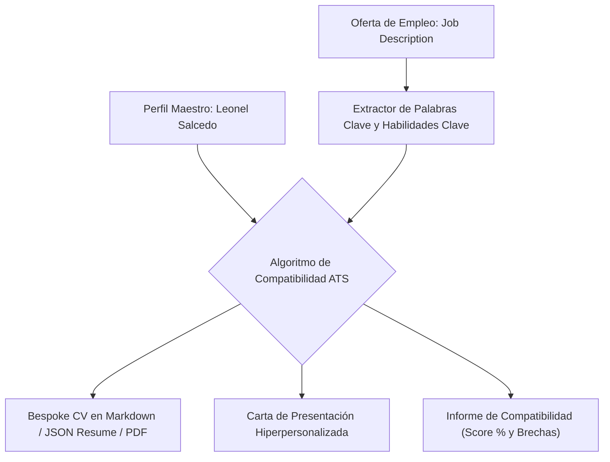

# ATS Optimization & Bespoke CV Engineering Mastery

**Propósito:** Guía técnica para la ingeniería de currículums de alta conversión, optimización para sistemas de seguimiento de candidatos (ATS: Greenhouse, Lever, Workable, Ashby, Taleo) y redacción de logros medibles.  
**Cumplimiento Normativo:** ISO 9001 (Calidad y Relevancia de Documentos), ISO 25010 (Usabilidad y Claridad Estructural).

---

## 1. Arquitectura de un CV Optimizado para ATS

---

## 2. Los 4 Pilares de Optimización ATS

1. **Jerarquía Tipográfica Simple y Limpia:**
   - Usar títulos de sección estándar universales: `Resumen Ejecutivo / Summary`, `Experiencia Profesional / Professional Experience`, `Habilidades Técnicas / Technical Skills`, `Proyectos Destacados / Key Projects`, `Educación y Certificaciones / Education & Certifications`.
2. **Densidad y Concordancia de Palabras Clave:**
   - Incluir las tecnologías exactas mencionadas en la oferta (ej. si la oferta pide *"Angular 19 Standalone Components"*, no escribir genéricamente *"Frameworks JS"*).
3. **Formato de Viñetas de Logro (Google XYZ / STAR):**
   - Iniciar cada viñeta con un verbo de acción fuerte en pasado o presente activo (*Arquitecté, Diseñé, Implementé, Lideré, Reduje, Incrementé*).
   - Incluir números, porcentajes o métricas de impacto siempre que sea posible.
4. **Cero Elementos Disruptivos para Parsers:**
   - Evitar tablas complejas con celdas fusionadas, cuadros de texto flotantes, gráficos de barras para niveles de habilidad ("90% JavaScript") o iconos que se interpreten como caracteres extraños en UTF-8.
