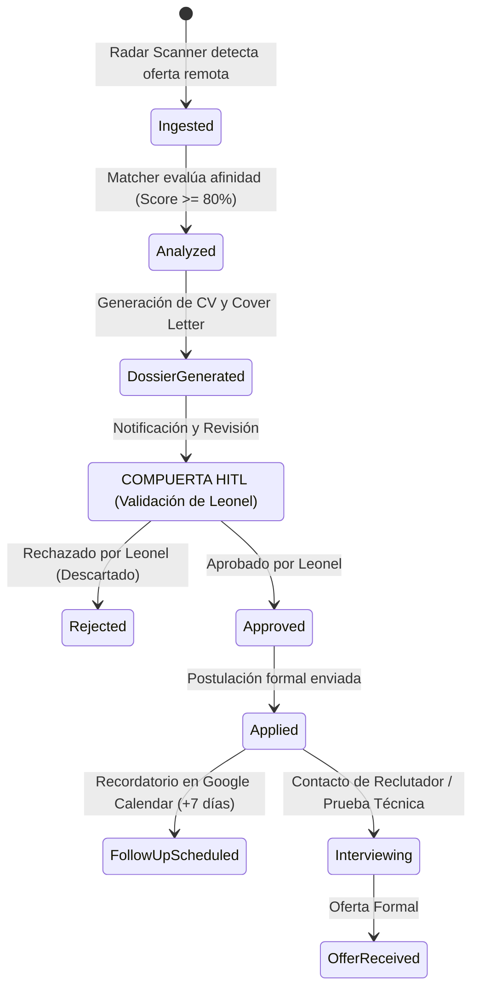

# Remote Job Application Pipeline & HITL Governance

**Propósito:** Especificación del ciclo de vida de postulaciones remotas, fases del embudo de contratación, compuerta de aprobación *Human-in-the-Loop* (HITL) y sincronización con Google Workspace.  
**Cumplimiento Normativo:** ISO 9001:2015, ISO 27001 (Confidencialidad).

---

## 1. Ciclo de Vida del Pipeline de Postulaciones

---

## 2. Esquema de Datos para Google Sheets Tracker (`google-workspace-ecosystem`)

| Columna | Tipo de Dato | Descripción |
| :--- | :--- | :--- |
| **Fecha de Detección** | `YYYY-MM-DD` | Fecha en la que el radar indexó la vacante. |
| **Empresa** | `Texto` | Nombre de la compañía (ej. Canonical, Clarity AI). |
| **Título del Rol** | `Texto` | Nombre del cargo (ej. Lead AI Systems Architect). |
| **URL de la Oferta** | `URL` | Enlace directo al portal ATS. |
| **Score de Afinidad** | `Porcentaje` | Grado de coincidencia ($0\% - 100\%$) con el perfil de Leonel. |
| **Estado HITL** | `PENDIENTE / APROBADO / DESCARTADO` | Decisión explícita de Leonel. |
| **Estado del Pipeline** | `EVALUADO / POSTULADO / ENTREVISTA / OFERTA` | Fase actual del proceso de selección. |
| **Ruta del Dossier** | `Path local` | Enlace al CV y Carta de Presentación generados. |
