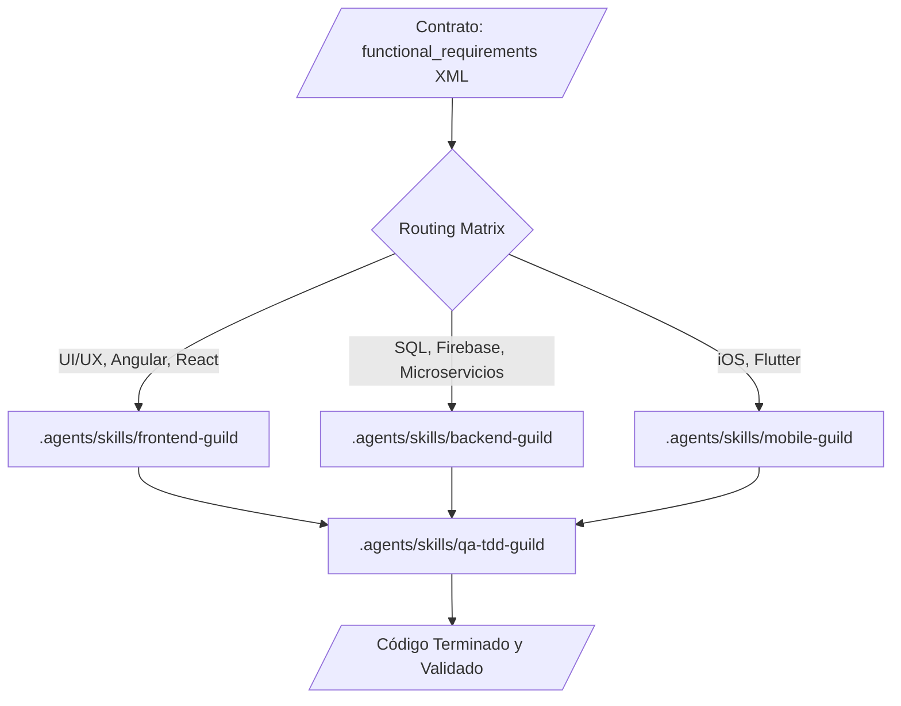

# Software Engineering Ecosystem

**WHAT**: Este ecosistema ejecuta la fase de construcción de código (Software Engineering) utilizando un modelo de Gremios (Guilds) altamente especializados. Consume el contrato de datos `<functional_requirements>` generado por el `docs-as-code-ecosystem` para enrutar tareas hacia expertos en Frontend, Backend, Mobile y QA/TDD, garantizando la adherencia a la norma ISO 25010 (Calidad del Software).

## Ecosystem Routing (Graphify Core)

1. `frontend-guild`: Agentes enfocados en interfaces inmersivas, rendimiento minimalista, React, Angular (MCP), HTML5 Canvas, y CSS moderno.
2. `backend-guild`: Agentes especializados en arquitectura de datos estricta (SQL vs NoSQL con Firebase MCP), Data-Driven Development y microservicios.
3. `mobile-guild`: Agentes enfocados en Flutter, iOS Nativo y React Native.
4. `qa-tdd-guild`: Validadores estrictos que aplican el ciclo Red-Green-Refactor y pruebas E2E.

> [!IMPORTANT]
> A diferencia de otros ecosistemas de auditoría, aquí **se preserva el balance de creatividad semántica (Top-P)** para permitir propuestas algorítmicas eficientes y evitar bucles de depuración ciegos. Todo requerimiento de dependencias externas invoca la **Capa de Control (HITL)** para triaje de red.

## Architectural Topology (Graphify Map)

