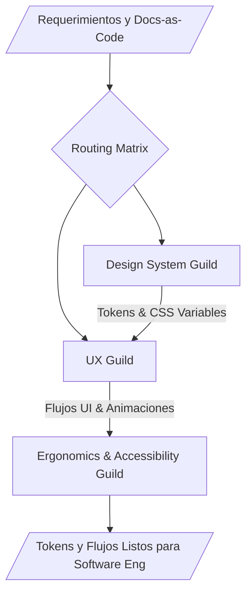

# UI/UX Design Ecosystem

**WHAT**: Este ecosistema gestiona toda la capa de diseño, experiencia de usuario (UX) y validación de accesibilidad (Ergonomía y Normativas WCAG/ISO 9241). Es el responsable de generar los sistemas de diseño, wireframes y prototipos a partir de los requerimientos, para luego ser consumidos por el ecosistema de ingeniería de software.

## Ecosystem Routing (Graphify Core)

El ecosistema opera mediante tres sub-gremios hiper-especializados:

1. **Design System Guild**: Crea la identidad visual y los tokens.
   - `design-tokens-architect`
   - `figma-stitch-integrator`
2. **UX Guild**: Diseña flujos, arquitecturas de la información e interacciones visuales avanzadas.
   - `ux-flow-designer`
   - `micro-interactions-animator`
3. **Ergonomics & Accessibility Guild**: Audita el diseño asegurando accesibilidad estricta.
   - `wcag-accessibility-auditor`
   - `screen-reader-testing-expert`

## Architectural Topology (Graphify Map)

