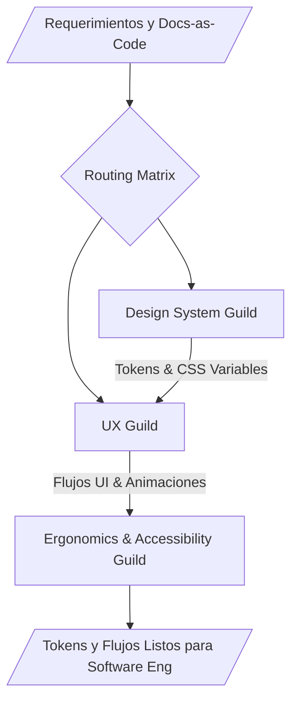

# UI/UX Design Ecosystem

**WHAT**: Este ecosistema gestiona toda la capa de diseño, experiencia de usuario (UX) y validación de accesibilidad (Ergonomía y Normativas WCAG/ISO 9241). Es el responsable de generar los sistemas de diseño, wireframes y prototipos a partir de los requerimientos, para luego ser consumidos por el ecosistema de ingeniería de software.

## Ecosystem Routing (Graphify Core)

El ecosistema opera mediante tres sub-gremios hiper-especializados:

1. **Design System Guild**: Crea la identidad visual, especificaciones `DESIGN.md`, tokens y plantillas de presentación de marca.
   - `.agents/skills/design-tokens-architect` (Tokens YAML, contrastes WCAG y transpilación CSS/Tailwind)
   - `.agents/skills/design-system-architect` (Arquitectura integral de Sistemas de Diseño y Guías de Estilos DESIGN.md)
   - `.agents/skills/figma-stitch-integrator`
   - `.agents/skills/genesis-brand-presentation-specialist`
2. **Anti-Slop Frontend & Taste Guild (Taste Skill v2)**: Erradicación de patrones genéricos de IA, inferencia de brief (*Design Read*), calibración de 3 diales (`VARIANCE/MOTION/DENSITY`) y familias estéticas especializadas.
   - `.agents/skills/design-taste-frontend-specialist` (Dirección de arte frontend anti-slop v2)
   - `.agents/skills/minimalist-editorial-designer` (Minimalismo suizo, Linear/Notion aesthetics)
   - `.agents/skills/industrial-brutalist-designer` (Modernismo industrial, cuadrículas expuestas, alto contraste)
   - `.agents/skills/luxury-soft-ui-designer` (Elegancia táctil prémium, espaciado generoso, spring physics)
   - `.agents/skills/ui-redesign-audit-specialist` (Auditoría previa y refactorización visual quirúrgica)
   - `.agents/skills/image-to-code-pipeline-specialist` (Pipeline: comp visual ➔ deconstrucción JSON ➔ código frontend)
3. **UX Guild**: Diseña flujos, arquitecturas de la información e interacciones visuales avanzadas.
   - `.agents/skills/ux-flow-designer`
   - `.agents/skills/micro-interactions-animator`
4. **Ergonomics & Accessibility Guild**: Audita el diseño asegurando accesibilidad estricta.
   - `.agents/skills/wcag-accessibility-auditor`
   - `.agents/skills/screen-reader-testing-expert`

> [!IMPORTANT]
> **Flexibilidad Semántica Híbrida:** Los gremios de diseño (Tokens y UX) operan con **creatividad paramétrica** (Top-P relajado) para maximizar la innovación y calidad estética. Sin embargo, el Gremio de Accesibilidad opera con **rigor absoluto (Temperatura 0)**. Toda conexión de red a Figma u otras herramientas dispara la **Capa de Control (Triaje HITL)**.

## Architectural Topology (Graphify Map)

