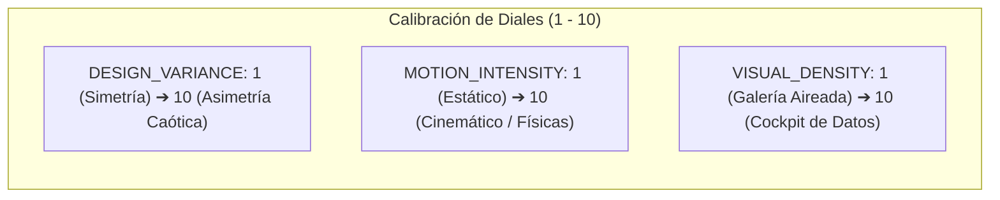

# Anti-Slop Frontend & Design Engineering: Taste Skill Mastery

**Referencia Oficial:** Taste Skill Framework (`Leonxlnx/taste-skill`)  
**Propósito:** Marco integral de ingeniería y dirección de arte frontend para erradicar interfaces genéricas ("AI-slop"), plantillas predecibles y patrones monótonos en aplicaciones web, landing pages y portafolios de nivel prémium.  
**Cumplimiento Normativo:** ISO 25010 (Usabilidad y Estética Visual), WCAG 2.1 AA/AAA, DORA.

---

## 1. El Protocolo de Inferencia de Brief ("Design Read")

Antes de emitir una sola línea de código CSS, Tailwind o TypeScript, el agente debe **leer la sala (*Read the Room*)** e inferir la intención estética real del usuario:

### A. Señales Clave a Analizar:
1. **Tipo de Página:** Landing (SaaS, consumidor, agencia, evento), Portafolio (diseñador, desarrollador, estudio creativo), Rediseño (preservación vs. renovación total), Producto editorial o blog.
2. **Vocabulario de Tonalidad (*Vibe Words*):** "Minimalista", "Linear-style", "Calm", "Apple-like", "Awwwards", "Brutalista", "Lujo / Alta gama", "B2B Corporativo", "Editorial".
3. **Referencias Visuales:** Enlaces, capturas de pantalla, competidores citados o marcas de inspiración.
4. **Audiencia Objetivo:** Compradores técnicos B2B, consumidores prémium, reclutadores de diseño. La audiencia dicta el lenguaje visual.
5. **Restricciones Silenciosas:** Requisitos de accesibilidad crítica (WCAG AAA), sector público o fintech.

### B. Salida Obligatoria del "Design Read":
El agente debe declarar explícitamente en una línea antes de comenzar:
> **"Reading this as: `<tipo de página>` for `<audiencia>`, with a `<lenguaje estético>` language, leaning toward `<sistema de diseño o familia visual>`."**

---

## 2. Los Tres Diales de Calibración (*The Three Dials*)

Toda decisión estructural, tipográfica y de animación está gobernada por tres parámetros numéricos en escala del 1 al 10:



| Escenario / Caso de Uso | DESIGN_VARIANCE | MOTION_INTENSITY | VISUAL_DENSITY |
| :--- | :---: | :---: | :---: |
| **Landing SaaS Mainstream** | `7` | `6` | `4` |
| **Landing de Agencia / Creativa** | `9` | `8` | `3` |
| **Consumidor Prémium / Lujo** | `7` | `6` | `3` |
| **Portafolio de Diseñador** | `8` | `7` | `3` |
| **Portafolio de Desarrollador** | `6` | `5` | `4` |
| **Editorial / Minimalista (Linear style)** | `5 - 6` | `3 - 4` | `2 - 3` |
| **Industrial / Brutalista** | `9 - 10` | `4 - 6` | `5 - 7` |
| **Rediseño (Preservación)** | *Mismo existente* | *+1* | *Mismo existente* |
| **Rediseño (Renovación total)** | *+2* | *+2* | *Mismo existente* |

---

## 3. Disciplina Anti-Default (Prohibición de "AI-Slop")

Queda terminantemente prohibido caer en los patrones predecibles generados por modelos de lenguaje genéricos:

```
❌ PROHIBICIONES ANTI-SLOP:
1. Degradados morados/púrpuras de IA genéricos sobre fondo oscuro.
2. Héroes perfectamente centrados con una malla de gradiente desenfocada detrás.
3. Secciones con exactamente tres tarjetas idénticas de igual ancho y alto.
4. Glassmorphism exagerado (backdrop-filter: blur) aplicado indiscriminadamente a todo.
5. Microanimaciones en bucle infinito que distraen y no aportan retroalimentación funcional.
6. Tipografía por defecto (Inter o Roboto) combinada con fondos genéricos slate-900.
```

---

## 4. Familias Estéticas Especializadas

### A. Minimalismo Editorial (Linear / Notion Aesthetics)
* **Tipografía:** Sans geométricas refinadas (Geist, Inter Display, Archivo) con seguimiento (*tracking*) ajustado en títulos.
* **Color:** Fondos neutros profundos o pergamino suave (`#FDFDFD`), acentos monocromáticos y bordes tenues de 1px (`rgba(255,255,255,0.08)` o `rgba(0,0,0,0.06)`).
* **Movimiento:** Transiciones rápidas y discretas (`150ms - 250ms`, `cubic-bezier(0.16, 1, 0.3, 1)`).

### B. Industrial Brutalist (Swiss / Raw Modernism)
* **Tipografía:** Grotesk pesada y monoespaciada (Chivo Mono, Space Mono, JetBrains Mono, Syne).
* **Composición:** Cuadrículas visibles, bordes sólidos de 2px a 3px, contraste alto y asimetría controlada.
* **Color:** Blanco y negro estricto con un único color de acento industrial estridente (naranja seguridad, amarillo señalética, verde terminal).

### C. Luxury / Soft UI (High-End Tactile Elegance)
* **Tipografía:** Serifas editoriales prémium (Spectral, Playfair, Cormorant) combinadas con sans limpias.
* **Composición:** Espaciado generoso, proporciones áureas y ritmos visuales pausados.
* **Físicas:** Animaciones basadas en resortes elásticos (*spring physics*, amortiguación suave).

---

## 5. Protocolo de Auditoría de Rediseño (*Audit-First*)

Al intervenir proyectos existentes:
1. **Auditoría Estructural:** Analizar la jerarquía visual actual, identificar redundancias de espaciado y niveles de contraste WCAG.
2. **Preservación de Tokens de Marca:** Identificar y respetar colores institucionales y tipografías corporativas preexistentes.
3. **Refactorización Quirúrgica:** Aplicar correcciones progresivas de layout, ritmo vertical y motion sin romper la arquitectura de componentes.

---

## 6. Lista de Verificación Pre-Vuelo (*Pre-Flight Check*)

Antes de entregar cualquier código o componente:
- [ ] ¿Se declaró el *Design Read* explícito?
- [ ] ¿Los tres diales (`VARIANCE`, `MOTION`, `DENSITY`) corresponden al caso de uso?
- [ ] ¿Se evitó cualquiera de los 6 patrones de *AI-Slop* prohibidos?
- [ ] ¿El contraste cumple con WCAG 2.1 AA ($4.5:1$ en texto normal, $3:1$ en texto grande)?
- [ ] ¿El código entregado está 100% completo, sin comentarios de marcador de posición (*zero placeholders*)?
