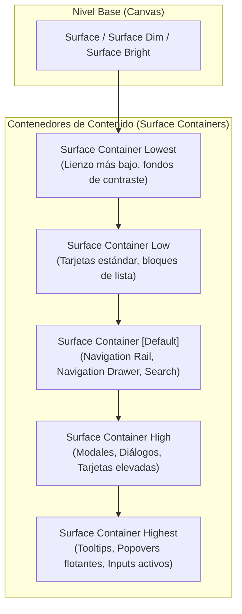

# Material Design 3 (M3) Web Design System & Gestalt Ergonomics Mastery

**Propósito:** Especificación de ingeniería y diseño canónico de **Material Design 3 (M3 Web)** derivado de `m3.material.io`: arquitectura de superficies tonales (*Surface Containers 1 a 5*), roles de color dinámicos, componentes canónicos (Navigation Rail, Navigation Drawer, Steppers, Botonera M3, Tarjetas, Diálogos), ritmo vertical modular de 8px y principios de la psicología de la Gestalt para interfaces web empresariales de alta densidad y accesibilidad.  
**Cumplimiento Normativo:** WCAG 2.2 Nivel AA/AAA, ISO 9241-110 (Ergonomía de Interacción Humano-Sistema), W3C Web Components & Modern CSS Standards.

---

## 1. El Paradigma Tonal de M3: De las Sombras Opacas a los Contenedores de Superficie

Históricamente (Material Design 1 y 2), la elevación se expresaba mediante superposiciones de color semitransparentes sobre un fondo estático y sombras (*box-shadows*) pronunciadas. En **Material Design 3**, Google eliminó el acoplamiento directo entre elevación y sombra, introduciendo el **Sistema de Contenedores de Superficie Tonales (*Tonal Surface Containers*)**:



### Correspondencia Canónica de Mapeo:
- **Nivel 0 (Fondo General):** `surface` (Light: `#f8f9ff` / Dark: `#111418`).
- **Nivel 1 (Contenido Pasivo / Bajo Énfasis):** `surface-container-low` (Light: `#f2f3fc` / Dark: `#191c20`).
- **Nivel 2 (Navegación / Énfasis Normal):** `surface-container` (Light: `#eceef6` / Dark: `#1d2024`).
- **Nivel 3 (Contenedor Primario / Alto Énfasis):** `surface-container-high` (Light: `#e6e8f0` / Dark: `#272a2f`).
- **Nivel 4/5 (Contenedor Flotante / Máximo Énfasis):** `surface-container-highest` (Light: `#e0e2eb` / Dark: `#32353a`).

---

## 2. Anatomía de Componentes Canónicos M3 Web

### A. Botonera M3 (5 Variantes Oficiales con Ergonomía de 40px)

```html
<!-- 1. FILLED BUTTON (Acción Primaria) -->
<button class="md-btn md-btn-filled">
  <span class="material-symbols-outlined icon">send</span>
  <span>Confirmar Envío</span>
</button>

<!-- 2. FILLED TONAL BUTTON (Acción Secundaria Destacada) -->
<button class="md-btn md-btn-tonal">
  <span class="material-symbols-outlined icon">edit</span>
  <span>Editar Dictamen</span>
</button>

<!-- 3. ELEVATED BUTTON (Separación Tonal Suave) -->
<button class="md-btn md-btn-elevated">
  <span class="material-symbols-outlined icon">share</span>
  <span>Compartir</span>
</button>

<!-- 4. OUTLINED BUTTON (Acción Alternativa Delimitada) -->
<button class="md-btn md-btn-outlined">
  <span class="material-symbols-outlined icon">download</span>
  <span>Descargar Registro</span>
</button>

<!-- 5. TEXT BUTTON (Acción Terciaria / Cancelar) -->
<button class="md-btn md-btn-text">
  <span>Descartar</span>
</button>
```

#### Estilos CSS Canónicos:
```css
.md-btn {
  display: inline-flex;
  align-items: center;
  justify-content: center;
  gap: 8px;
  min-height: 40px;
  padding: 0 24px;
  border-radius: var(--md-sys-shape-corner-full, 9999px);
  font: var(--md-sys-typescale-label-large);
  border: none;
  cursor: pointer;
  text-decoration: none;
  position: relative;
  overflow: hidden;
  transition: background-color 0.2s cubic-bezier(0.2, 0, 0, 1),
              box-shadow 0.2s cubic-bezier(0.2, 0, 0, 1),
              color 0.2s cubic-bezier(0.2, 0, 0, 1);
}

.md-btn-filled {
  background-color: var(--md-sys-color-primary);
  color: var(--md-sys-color-on-primary);
}
.md-btn-filled:hover {
  box-shadow: 0 1px 3px rgba(0,0,0,0.12), 0 1px 2px rgba(0,0,0,0.24);
  background-color: color-mix(in srgb, var(--md-sys-color-primary) 92%, var(--md-sys-color-on-primary));
}

.md-btn-tonal {
  background-color: var(--md-sys-color-secondary-container);
  color: var(--md-sys-color-on-secondary-container);
}
.md-btn-tonal:hover {
  background-color: color-mix(in srgb, var(--md-sys-color-secondary-container) 92%, var(--md-sys-color-on-secondary-container));
}

.md-btn-elevated {
  background-color: var(--md-sys-color-surface-container-low);
  color: var(--md-sys-color-primary);
  box-shadow: 0 1px 3px rgba(0,0,0,0.1), 0 1px 2px rgba(0,0,0,0.15);
}

.md-btn-outlined {
  background-color: transparent;
  color: var(--md-sys-color-primary);
  border: 1px solid var(--md-sys-color-outline);
}
.md-btn-outlined:hover {
  background-color: color-mix(in srgb, var(--md-sys-color-primary) 8%, transparent);
}

.md-btn-text {
  background-color: transparent;
  color: var(--md-sys-color-primary);
  padding: 0 12px;
}
.md-btn-text:hover {
  background-color: color-mix(in srgb, var(--md-sys-color-primary) 8%, transparent);
}
```

---

### B. Navigation Rail (Ergonomía de Escritorio / Tablet $\ge 600\text{px}$)

El **Navigation Rail** es el ancla ergonómica estándar de M3 para pantallas de alta densidad:
- **Ancho:** Exactamente **80px**.
- **Píldora Activa:** 56×32px con fondo `secondary-container` y esquinas redondeadas al 100%.
- **Etiqueta:** Debajo del icono, en tipografía `label-medium` (12px, tabular).

```html
<nav class="md-nav-rail">
  <div class="md-nav-rail-header">
    <button class="md-fab-small" title="Acción Rápida">
      <span class="material-symbols-outlined">add</span>
    </button>
  </div>
  <div class="md-nav-rail-items">
    <a href="#expediente" class="md-rail-item active">
      <div class="md-rail-pill">
        <span class="material-symbols-outlined">folder</span>
      </div>
      <span class="md-rail-label">Expediente</span>
    </a>
    <a href="#workspace" class="md-rail-item">
      <div class="md-rail-pill">
        <span class="material-symbols-outlined">cloud_sync</span>
      </div>
      <span class="md-rail-label">Workspace</span>
    </a>
  </div>
</nav>
```

```css
.md-nav-rail {
  width: 80px;
  height: 100vh;
  background-color: var(--md-sys-color-surface);
  border-right: 1px solid var(--md-sys-color-outline-variant);
  display: flex;
  flex-direction: column;
  align-items: center;
  padding: 16px 0;
  box-sizing: border-box;
}

.md-rail-item {
  display: flex;
  flex-direction: column;
  align-items: center;
  text-decoration: none;
  color: var(--md-sys-color-on-surface-variant);
  margin-bottom: 12px;
  width: 100%;
}

.md-rail-pill {
  width: 56px;
  height: 32px;
  border-radius: var(--md-sys-shape-corner-large, 16px);
  display: flex;
  align-items: center;
  justify-content: center;
  transition: background-color 0.2s cubic-bezier(0.2, 0, 0, 1);
}

.md-rail-item.active .md-rail-pill {
  background-color: var(--md-sys-color-secondary-container);
  color: var(--md-sys-color-on-secondary-container);
}

.md-rail-label {
  font: var(--md-sys-typescale-label-medium);
  margin-top: 4px;
}
```

---

### C. Stepper Progresivo (Flujo de Fases & Misiones)

```html
<div class="md-stepper">
  <div class="md-step completed">
    <div class="md-step-circle"><span class="material-symbols-outlined">check</span></div>
    <span class="md-step-title">Fase 1: Triage</span>
  </div>
  <div class="md-step-line completed"></div>
  <div class="md-step active">
    <div class="md-step-circle">2</div>
    <span class="md-step-title">Fase 2: Evidencia</span>
  </div>
  <div class="md-step-line"></div>
  <div class="md-step pending">
    <div class="md-step-circle">3</div>
    <span class="md-step-title">Fase 3: Informe</span>
  </div>
</div>
```

---

## 3. Leyes de la Gestalt & Ritmo Vertical Ergonómico

| Ley Gestalt | Aplicación en M3 Web | Mapeo Numérico / Token |
| :--- | :--- | :--- |
| **Proximidad** | Contigüidad estricta entre etiquetas y campos; aislamiento entre módulos. | Etiqueta-Input: `4px–8px`<br>Campos en grupo: `16px`<br>Módulos: `24px–32px` |
| **Semejanza** | Mismo radio y peso formal para elementos de la misma jerarquía funcional. | Botones: `radius: 9999px`<br>Cards: `radius: 12px`<br>Modales: `radius: 28px` |
| **Figura-Fondo** | Separación por contraste de tono en contenedores sin saturar con sombras. | Fondo: `surface`<br>Tarjeta: `surface-container-low`<br>Modal: `surface-container-high` |
| **Continuidad** | Alineación en retícula estricta de 8px que guía el rastreo ocular (scan path). | Cuadrícula modular base de `8px` (`8, 16, 24, 32, 48, 64px`) |
| **Cierre** | Delimitación perimetral limpia en formularios y paneles de inspección. | Borde sutil: `1px solid var(--md-sys-color-outline-variant)` |

---

## 4. Matriz de Coexistencia & Cero Ruido

- **Convivencia con `modern-web-guidance-plugin`:**
  * M3 Web aporta los **roles visuales y tokens semánticos**.
  * `modern-web-guidance-plugin` aporta la **implementación nativa de APIs** (usar `<dialog>` nativo con backdrop M3, usar CSS View Transitions al alternar vistas en el Navigation Rail, usar `@starting-style` para animaciones de entrada).
- **Convivencia con `ui-ux-design-ecosystem` (Taste Skill v2):**
  * Taste Skill define la dirección de arte y anti-slop (minimalismo editorial suizo, industrial brutalista, etc.).
  * M3 Web suministra la **disciplina de componentes de productividad** (formularios, steppers, barras de herramientas, data tables y drawers) para herramientas de trabajo intensivo.
