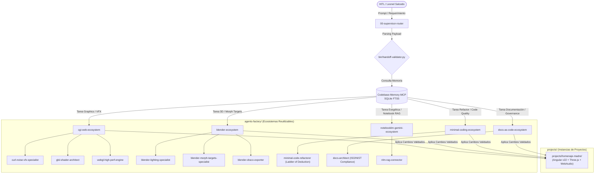

# NOMACKSTUDIO ECOSYSTEM — ARQUITECTURA AGÉNTICA, MEMORIA PERSISTENTE Y MATRIZ DE DELEGACIÓN

## Guía Maestra para Agentes IA & Human-in-the-Loop (HITL)

**Autoría Oficial:** Nomack (Leonel Salcedo) — Dirección de Arte, Arquitectura Agéntica & Desarrollo WebGL  
**Ejecutor Lead en Sitio:** Leonel Salcedo  
**Versión Documental:** 2.0.0 (Master Governance & Handoff Specification)  
**Cumplimiento Normativo:** ISO 9001:2015, ISO 42001 (AIMS), ISO 27001 (ISMS), NIST CSF 2.0, DORA & `implicit/`

---

```xml
<corporate_context>
  <system_name>NomackStudio Ecosystem</system_name>
  <lead_architect>Nomack (Leonel Salcedo)</lead_architect>
  <architecture_mode>DESACOPLAMIENTO_ESTRICTO_AGENTS_FACTORY_VS_PROJECTS</architecture_mode>
  <persistent_memory_engine>Codebase-Memory-MCP (SQLite FTS5 + Graphify Indexer)</persistent_memory_engine>
  <llm_orchestration_stack>Google Gemini 3.6 Flash (Low / Medium / High Thinking Levels)</llm_orchestration_stack>
</corporate_context>
```

---

## 1. Principio Fundamental: Desacoplamiento de `agents-factory/` vs `projects/`

Para evitar la contaminación cruzada y garantizar la reutilización continua de agentes, el ecosistema se divide estrictamente en dos reinos desacoplados:

```
                  +-------------------------------------------------------------+
                  |                  NOMACKSTUDIO WORKSPACE                     |
                  +-------------------------------------------------------------+
                                                 |
                       +-------------------------+-------------------------+
                       |                                                   |
                       v                                                   v
        +-----------------------------+                     +-----------------------------+
        |       agents-factory/       |                     |          projects/          |
        +-----------------------------+                     +-----------------------------+
        | Ecosistemas Agénticos        |                     | Instancias de Proyectos     |
        | Generales Reutilizables     |                     | Corporativos y Personales   |
        | (ej. cgi-web-ecosystem,     |                     | (ej. proyectos/homenaje-    |
        | blender-ecosystem, etc.)    |                     | madre, proyectos/nomack...) |
        +-----------------------------+                     +-----------------------------+
```

1. **`agents-factory/`**: Fábrica de Ecosistemas Agénticos Generales. **NUNCA** contiene código de proyectos individuales. Alberga los roles, habilidades (`.agents/skills/`), reglas (`.agents/rules/`) y taxonomía Neo-CRISPE multi-proyecto (ej. `cgi-web-ecosystem`, `blender-ecosystem`, `minimal-coding-ecosystem`).
2. **`projects/`**: Repositorios de Entregables e Instancias de Producción. Contiene el código fuente Angular v22, mallas GLB, assets de arte y suites de pruebas de cada proyecto cliente o personal.

---

## 2. Memoria Persistente y Economía de Tokens (`Codebase-Memory-MCP`)

La memoria del agente no reside únicamente en la ventana de contexto. Se estructura en **3 Niveles**:

1. **Memoria Procedural (`.agents/skills/`)**: Instrucciones de ejecución directa y fórmulas matemáticas (ej. derivación de Curl Noise, shaders Sumi-e).
2. **Memoria Semántica e Indexada (`Codebase-Memory-MCP` SQLite)**: Base de datos en `mcp/codebase-memory-mcp/data/codebase_memory.sqlite` alimentada automáticamente por `python bin/indexer.py` (relaciones `CONTAINS`, `DEPENDS_ON`, búsqueda superrápida con FTS5).
3. **Memoria Episódica & RAG (`knowledge/` & Gemini Notebooks)**: Almacena papers exegéticos y sesiones de NotebookLM (`nlm`).

> [!IMPORTANT]
> **REGLA DE ORO PARA EL AGENTE NUEVO:** Ante cualquier duda sobre qué código modificar, qué skill usar o dónde reside un componente, **NUNCA alucinar ni hacer escaneos masivos en texto plano**. Ejecuta consultas relacionales sobre SQLite (`Codebase-Memory-MCP`) o revisa el índice con `indexer.py`.

---

## 3. Diagrama Arquitectónico Completo & Grafo de Flujos (Mermaid)



---

## 4. Matriz de Enrutamiento y Guía de Delegación para la IA

Cuando el agente nuevo reciba un requerimiento del usuario, debe seguir esta matriz de decisión de enrutamiento:

| Necesidad Detectada | Ecosistema a Invocar (`agents-factory/`) | Acción / Skill a Ejecutar |
| :--- | :--- | :--- |
| **Simulación de partículas GPU / Curl Noise** | `cgi-web-ecosystem` | Cargar `curl-noise-vfx-specialist` y aplicar la formulación del operador Curl $\nabla \times \vec{\Psi}$. |
| **Shaders GLSL (Sumi-e, acuarela, Sobel)** | `cgi-web-ecosystem` | Cargar `glsl-shader-architect` para construir vertex/fragment shaders en `src/shaders/`. |
| **Iluminación 3D, Composición, Draco GLB** | `blender-ecosystem` | Cargar `blender-lighting-specialist` / `blender-draco-exporter` e invocar scripts vía `blender-mcp`. |
| **Optimización de código / Reducción LOC** | `minimal-coding-ecosystem` | Aplicar la *Escalera de Deducción de 7 Peldaños* (-54% LOC, 0 alucinaciones). |
| **Redacción de documentación e ISO/NIST** | `docs-as-code-ecosystem` | Generar entregables en `docs/` cumpliendo la jerarquía visual de portadas oficiales. |
| **Consultas RAG de Notebooks** | `notebooklm-gemini-ecosystem` | Ejecutar `python authenticate_notebooklm.py` y consultar las fuentes del cuaderno via `nlm`. |

---

## 5. Protocolo de Autocuración & Watchdog Automático

Antes de comenzar cualquier sesión de trabajo o interaccionar con APIs externas, el agente debe verificar el estado del sistema con el Watchdog:

```bash
python bin/watchdog_health_check.py
```

Si el Watchdog notifica *Authentication Expired* en Gemini Notebook:

```bash
python authenticate_notebooklm.py
```

---

## 6. Firma y Autoría Oficial

**Dirección de Arte, Arquitectura Agéntica & Desarrollo WebGL:** Nomack (Leonel Salcedo)  
**Entidad:** Nomack Studio — Innovación Tecnológica & Arte Digital  
