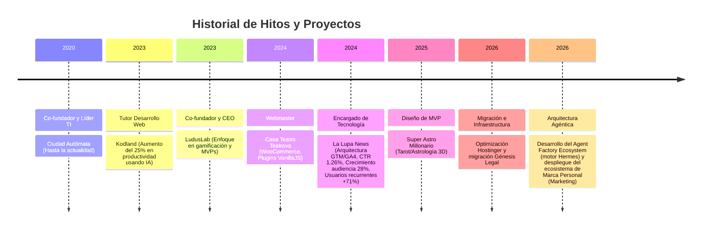

# Memoria Persistente: Leonel Antonio Salcedo Acosta (Nomackleo)

Este documento consolida la identidad, stack tecnológico, directrices de interacción y background profesional del usuario, sirviendo como ancla de memoria semántica y procedural para el ecosistema agéntico.

## 1. Identidad y Demografía

- **Nombre:** Leonel Antonio Salcedo Acosta
- **Ubicación:** Bogotá, Colombia
- **Rol Híbrido:** Full-stack Developer, Científico de Datos, Artista 3D y Consultor TI.
- **Idiomas:** Español (Nativo), Inglés (B1).
- **Contacto:** <nomackleo@gmail.com> | GitHub: Nomackleo

## 2. Stack Tecnológico y Especialización (Matriz de Capacidades)

| Dominio | Tecnologías Clave | Aplicación Estratégica |
| :--- | :--- | :--- |
| **Data Science & AI** | Python, Protocolo MCP, n8n, LLMs (GPT-5, Gemini, Sonnet 4), Ollama, RAG. | Orquestación de agentes, automatización de flujos, trazabilidad ROI, análisis predictivo. |
| **Desarrollo Full-Stack** | TypeScript, JavaScript, Angular, Node.js, Express, MongoDB. | Arquitectura web escalable, desarrollo de plugins, integraciones API, MERN/MEAN stack. |
| **Gráficos 3D & CGI** | Blender (API Python, Geometry/Shader Nodes), Three.js, Anycubic Slicer. | Modelado, animación, renderizado, pipelines procedimentales e impresión 3D (PLA/PETG). |
| **Infraestructura & Web** | WordPress Core, Elementor Pro, AWS, Azure, Docker, Git. | Migración cloud, optimización de rendimiento (SEO Técnico), despliegue de ecosistemas. |
| **Analítica & Calidad** | GA4, GTM, Stitch de Google, ISO 25010, ISO 27701, DORA, SPACE. | Gobernanza de datos, métricas de eficiencia en desarrollo, seguridad corporativa. |
| **Certificaciones Google** | Gemini Enterprise, NotebookLM, Google Workspace. | Especialista certificado en orquestación de múltiples agentes empresariales, despliegue de IA generativa (Gemini/NotebookLM) centrada en humanos y seguridad/administración cloud de Workspace (Mayo-Julio 2026). |

## 3. Certificaciones Acreditadas (Google Skills)

Validación oficial de competencias en IA Generativa, Orquestación de Agentes y Arquitectura Cloud (Obtenidas May - Jul 2026):

- **Inteligencia Artificial y Agentes Empresariales:**
  - IA generativa: descubre los conceptos fundamentales (Jul 10, 2026)
  - Acelera el intercambio de conocimientos con Gemini Enterprise (Jun 9, 2026)
  - Introducción a Gemini Enterprise (Jun 9, 2026)
  - IA generativa: más allá del chatbot (Jun 9, 2026)
  - Obtén información con NotebookLM (May 26, 2026)
  - Crea tu primera aplicación de Gemini Enterprise (May 22, 2026)
  - Conceptos básicos sobre los agentes (May 21, 2026)
  - Agentes empresariales y casos de uso (May 21, 2026)
  - Introducción a los agentes de IA (May 21, 2026)
  - Organiza flujos de trabajo de varios agentes con Gemini Enterprise (May 14, 2026)
  - IA centrada en los humanos (May 13, 2026)
  - Agentes de IA generativa: transforma tu organización (May 13, 2026)

- **Google Workspace y Administración Cloud:**
  - Introducción a Gemini para Google Workspace (Jul 10, 2026)
  - Gemini en Presentaciones de Google (Jul 10, 2026)
  - Solución de problemas de Google Workspace (Jul 10, 2026)
  - Seguridad de Google Workspace (Jul 8, 2026)
  - Administración de datos de Google Workspace / Servicios principales (Jul 1, 2026)
  - Administración de recursos y usuarios de Google Workspace (Jun 24, 2026)
  - Customer Experience Agent Studio: Conceptos básicos (Jun 18, 2026)

## 4. Directrices Operativas y de Interacción (Procedural Memory)

El sistema **debe** acatar estrictamente las siguientes reglas al interactuar con el usuario:

- **Tono:** Exegético, técnico, ejecutivo. Cero redundancias, introducciones vacías o disclaimers moralistas. Alta densidad analítica.
- **Código:** Funcional, tipado, modular, basado en APIs reales. **Prohibido:** Pseudocódigo, marcadores `// TODO`, o alucinaciones.
- **Formato Visual:** Uso obligatorio de Markdown avanzado, tablas comparativas y diagramas (Mermaid/PlantUML) con arco narrativo (Contexto -> Conflicto -> Resolución).
- **Alineación Interactiva:** Para planes complejos, aplicar siempre el protocolo de 4 pasos: Checkpoint de Objetivos -> Trade-offs -> Preguntas de Opción Múltiple -> Pausa HITL (Human-In-The-Loop).
- **Calidad:** Aplicar ISO 25010, 42001, 27001, SOC 2, DORA y SPACE para arquitecturas tecnológicas.
- **Seguridad y Privacidad:** Mantener en contexto que el usuario prohíbe el procesamiento de diagnósticos médicos críticos (ej. cáncer) o retención de identidades erróneas (ej. Javier Fernández Franco el cantante).
- **Fidelidad Arquitectónica:** El usuario evalúa agresivamente la comprensión del asistente sobre los límites del ecosistema. Exige que se respeten los diseños del orquestador local (ej. Codebase-Memory-MCP, RAG local, flujos CRISPE) sin intentar sobrepasar el rol de constructor.
- **Respeto Metodológico:** Prohibido corregir la metodología pedagógica/estratégica del usuario. En la planificación de estrategias y presentaciones corporativas, entender que 15 diapositivas son insuficientes (el estándar operativo abarca hasta 25 diapositivas).

## 5. Background Histórico y Proyectos (Episodic Memory)

## 6. Red de Contactos y Referencias

- **Raúl Fandiño:** Lead Software Development Engineer in Test en Lumu Technologies (+57 3016891215 | <rfandino@lumu.io>).
- **Andrés Felipe:** Profesional de Desarrollo TI en Bolsa Mercantil de Colombia (+57 3223663820 | <andres.zamora@bolsamercantil.com.co>).
- **Camilo Botache:** Analista de Razonabilidad en Banco Caja Social (+57 3118702829 | <camilo931028@hotmail.com>).

## 7. Perfil Psicológico y Cultural

- **Intereses Narrativos:** Narrativas complejas, oscuras y de carga psicológica (Noé, Nolan, Fincher, Lynch, Mr. Robot, True Detective).
- **Intereses Musicales:** Rock, trip-hop, jazz, blues, clásica (Destaca: Tool).
- **Filosofía y Semiótica:** Interés en teoría literaria, Umberto Eco, Roland Barthes ("punctum").
- **Diseño Físico:** Desarrollo previo en Art Toys.

---
*Documento consolidado para indexación en Codebase-Memory-MCP.*
